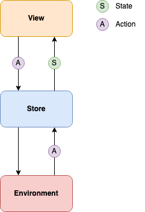

# SwiftUIEvent

I have written about why Redux is beneficial in the past, if you're interested please read this: 
https://itnext.io/functional-architecture-e9031090ff18

## Composable Architecture 

This framework enables us to write our apps in composable chunks, enabling teams to work entirely independently of one another on the same codebase.

I highly recommend watching these videos before picking up the framework, there are various other free videos on PointFree.co that expand on this architecture as well.

* [A Tour of the Composable Architecture: Part 1](https://www.pointfree.co/episodes/ep100-a-tour-of-the-composable-architecture-part-1)
* [A Tour of the Composable Architecture: Part 2](https://www.pointfree.co/episodes/ep101-a-tour-of-the-composable-architecture-part-2)
* [A Tour of the Composable Architecture: Part 3](https://www.pointfree.co/episodes/ep100-a-tour-of-the-composable-architecture-part-3)
* [A Tour of the Composable Architecture: Part 4](https://www.pointfree.co/episodes/ep100-a-tour-of-the-composable-architecture-part-4)

If you like what they do over there and want to view their full collection you can get a paid subscription, they talk through the problem clearly and discuss different approaches to solve the problem before landing on the solution.
